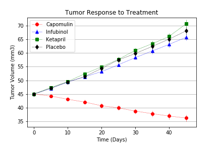
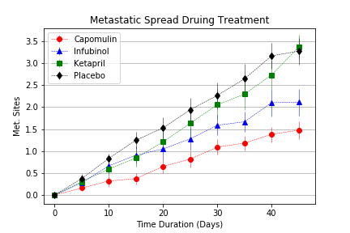
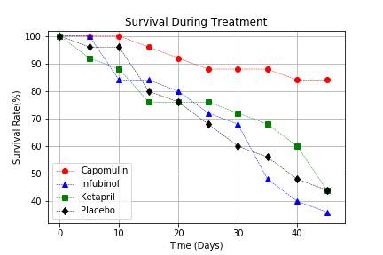
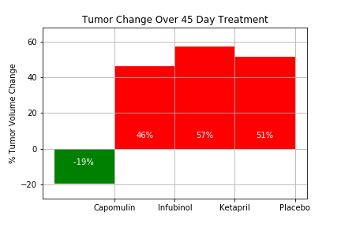

# matplotlib-challenge
## Summary ##
This project is designed to practice the use of Pandas and Matplotlib library in Python. Following tasks will be completed:
* Creating a scatter plot that shows how the tumor volume changes over time for each treatment.
* Creating a scatter plot that shows how the number of [metastatic](https://en.wikipedia.org/wiki/Metastasis) (cancer spreading) sites changes over time for each treatment.
* Creating a scatter plot that shows the number of mice still alive through the course of treatment (Survival Rate)
* Creating a bar graph that compares the total % tumor volume change for each drug across the full 45 days.
* Include 3 observations about the results of the study. Use the visualizations you generated from the study data as the basis for your observations.
## Data Source ##
* [Clinical-trial](data/clinicaltrial_data.csv)
* [Mouse-drug](data/mouse_drug_data.csv)
## Tool ##
Python (Jupyter Notebook): Matplotlib
## Visualization ##
* Tumor Response to Treatment 
 

* Metastatic Spread During Treatment 
 

* Survival During Treatment 
 

* Tumor Change over 45 Days Treatment 
 

## Contact ##
Email: xinlianghuang85@gmail.com